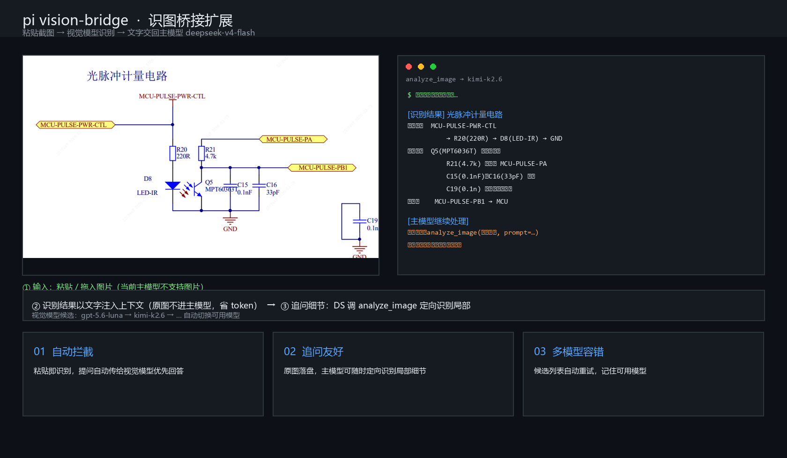

# Pi Extensions

Pi 扩展合集（一个包，`pi install` 一次装全部）。



## 扩展列表

| 扩展 | 说明 |
|---|---|
| [vision-bridge](#vision-bridge-识图桥接) | 让不支持图片的主模型也能看图 |

---

# Vision Bridge 识图桥接

Pi 扩展：让**不支持图片的主模型**（如 deepseek-v4-flash）也能"看图"。

粘贴图片或遇到图片任务时，自动把图片交给**视觉模型**（gpt-5.6-luna / kimi-k2.6 等候选列表，自动选择可用者）识别，把**文字描述**交回主模型继续处理。主模型全程不换，图片本体不进主上下文（省 token）。

## 功能

- **自动拦截**：粘贴 / 拖入图片时，若当前模型不支持图片，自动调用视觉模型识别，描述文字注入本轮 prompt；你的提问会一并传给识别模型（优先回答你的问题 + 完整转录）
- **analyze_image 工具**：主模型遇到图片路径 / URL 时主动调用，返回识别文字
- **追问友好**：粘贴的图片自动落盘到 `extensions/vision-bridge/images/`（自动清理，保留最近 50 张），DS 追问局部细节时用 `analyze_image` + 保存路径再次定向识别
- **多候选自动重试**：视觉模型被上游封锁（如 gpt-5.6-luna 部分地区 403）时自动切换下一个；记住可用的模型，避免重复撞墙
- **兼容原生**：切到支持图片的模型时自动放行（不干预），历史中的图片仍保留

## 安装

### 方式一：手动（最快）

把 `extensions/` 整个目录复制到：

```
~/.pi/agent/extensions/   # vision-bridge/index.ts 等子目录会被自动发现
```

pi 内执行 `/reload` 生效。

### 方式二：git

```bash
pi install git:https://github.com/braveboymy/pi-extensions
```

### 方式三：npm

```bash
pi install npm:@jours_757/pi-extensions
```

## 前提条件

1. pi（任意平台）
2. **一个支持图片输入的模型**，默认配置指向 `opencode-go` provider（pi 内置，需配置 `OPENCODE_API_KEY`）

## 配置

编辑 `index.ts` 顶部常量：

```ts
const VISION_PROVIDER = "opencode-go";   // 视觉模型所在 provider
const VISION_MODEL_CANDIDATES = [        // 候选视觉模型，按顺序尝试
  "gpt-5.6-luna",
  "kimi-k2.6",
  // ...
];
const VISION_MAX_TOKENS = 16_000;        // 单次识别最大输出 token
const VISION_TIMEOUT_MS = 120_000;       // 单次识别超时
```

如果没有 opencode-go，可改用任何 OpenAI 兼容 / Anthropic 兼容 provider（如 `anthropic`、`my_kimi`、自建网关），只需把 `VISION_PROVIDER` 换成对应 provider id，并确保候选模型在该 provider 下存在且支持图片。

## 使用

```bash
# 1. 粘贴图片（Ctrl+V / 拖入），自动识别
# 2. 追问细节
你：这张图左上角那个器件丝印是什么？
→ 主模型自动调用 analyze_image(保存路径, prompt="只看左上角...")
```

## 安全

扩展拥有完整系统权限，**安装第三方包前请审查源码**。本扩展逻辑简单：仅读取图片 → 调用你配置的视觉模型 → 返回文字。不含任何密钥（API key 通过 pi 自身 auth 机制运行时解析），不发送图片到第三方服务（只发给你自己配置的视觉模型端点）。

## 新增扩展

在 `extensions/` 下新建子目录放 `index.ts`（或直接放 `*.ts` 文件）即可，重新 push 后对方 `pi update` 生效：

```
extensions/
├── vision-bridge/index.ts   ← 现有
└── your-new-ext/index.ts    ← 以后新增
```

## 运行时文件

| 路径 | 说明 |
|---|---|
| `extensions/vision-bridge/images/` | 粘贴图片缓存（自动清理，保留最近 50 张） |
| `extensions/vision-bridge/.state.json` | 记住当前可用的视觉模型 |

## License

MIT
